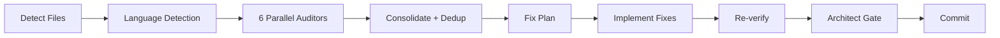

# Promotion Kit — CCA-Audit Launch

> Copy-paste ready posts for each channel. Replace `[LINK]` with `https://github.com/GiulioDER/cca-audit`.

---

## 1. Hacker News — Show HN

**Best time:** Tuesday-Thursday, 8-10am ET

**Title:**
```
Show HN: CCA-Audit – 6 parallel LLM auditors with non-overlapping scopes, zero duplicate findings
```

**Body (paste into URL field: leave blank, text field: paste below):**

```
I built an open-source pipeline that runs 6 specialized LLM auditors in parallel on your codebase. Each auditor exclusively owns a domain — security never flags code style, the bug scanner never flags missing docs — so findings don't overlap or contradict.

The pipeline:
1. Detects changed files + auto-detects language (Python, TS, Go, Rust, Java, Ruby)
2. Launches 6 auditors in parallel (code quality, bugs, security, performance, docs, config)
3. Deduplicates across auditors (same file:line → merge, keep highest severity)
4. Prioritizes: P1 Critical (security, data corruption) → P2 High → P3 cosmetic
5. Auto-fixes P1+P2, defers P3 to a second pass
6. Re-verifies (runs your test suite + linter)
7. Gates through an architect review (APPROVED / REVISE / BLOCKED)

The key design decision: non-overlapping scopes. When you give an LLM "review this code for everything," you get 30 findings where half are duplicates and some contradict each other. When you give 6 agents each a strict, exclusive scope, you get clean, actionable findings.

Three variants:
- Claude Code: drop-in `/audit-fix` slash command (one-line install)
- Codex CLI: shell script that parallelizes `codex` calls
- OpenRouter API: `pip install cca-audit` — works with any model (Claude, GPT-4, Gemini, Llama)

MIT licensed. Built this for a production system, extracted and generalized it.

https://github.com/GiulioDER/cca-audit
```

---

## 2. Reddit Posts

### r/ClaudeAI

**Title:** `I open-sourced a 6-agent code audit pipeline for Claude Code — one slash command, zero duplicate findings`

**Body:**

```
I've been running this internally on a production codebase for a while and finally extracted it into an open-source package.

**What it does:** Runs 6 specialized auditors in parallel on your changed files — code quality, bugs, security, performance, docs, and config validation. Each has a non-overlapping scope so you never get "Security says X but Code Quality says the opposite."

**How to install (Claude Code):**

    curl -fsSL https://raw.githubusercontent.com/GiulioDER/cca-audit/main/claude-code/install.sh | bash

**How to use:**

    /audit-fix              # audit + fix P1+P2, defer P3 cosmetic
    /audit-fix deferred     # second pass to close out P3 items
    /audit-fix no-fix       # report only
    /audit-fix commit 3     # audit last 3 commits

The pipeline deduplicates findings, auto-fixes critical issues, re-runs your tests to make sure nothing broke, then gates through an architect review agent that gives a final APPROVED/REVISE/BLOCKED verdict.

Also has a Codex CLI variant and a standalone Python CLI via OpenRouter if you want to use GPT-4 or other models.

GitHub: https://github.com/GiulioDER/cca-audit

MIT license. Feedback welcome — especially if you try it on a non-Python codebase, I'd love to hear how the language auto-detection works for you.
```

### r/ChatGPTCoding

**Title:** `One command to audit your entire codebase with 6 parallel AI agents (open-source, works with any LLM)`

**Body:**

```
Built an audit pipeline that runs 6 AI auditors in parallel on your code changes. Each agent has its own scope — security never touches code style, the bug scanner doesn't flag docs — so you get clean, non-overlapping findings.

The pipeline: detect files → language detection → 6 parallel auditors → dedup → prioritize (P1/P2/P3) → auto-fix → re-verify tests → architect review gate.

Three ways to run it:
1. **Claude Code:** `/audit-fix` (one slash command)
2. **Codex CLI:** `bash cca-audit.sh` (shell orchestrator)
3. **Any model via OpenRouter:** `pip install cca-audit && cca-audit`

The dedup step is where the magic happens — same file:line across different auditors gets merged into one finding with the highest severity. No more sorting through 30 findings that are really 12 unique issues.

Also supports a two-pass workflow: Round 1 fixes critical + high issues, defers cosmetic stuff. Round 2 (`--deferred`) closes out the cosmetic items in a separate commit.

Open-source, MIT licensed: https://github.com/GiulioDER/cca-audit
```

### r/programming

**Title:** `How non-overlapping scopes eliminate the #1 problem with LLM code review (open-source pipeline)`

**Body:**

```
The biggest problem with asking an LLM to review code: it tries to check everything at once, producing duplicate and contradictory findings. "This function is too complex" from one pass, "This function handles edge cases well" from another.

I solved this by splitting the audit into 6 agents, each with an **exclusive, non-overlapping scope**:

| Auditor | Checks | Does NOT Check |
|---------|--------|----------------|
| Code Quality | Type safety, DRY, complexity, naming | Security, runtime bugs |
| Bug Scanner | Null refs, race conditions, resource leaks | Security, code style |
| Security | OWASP Top 10, injection, auth, secrets | Runtime bugs, quality |
| Performance | Slow queries, hot paths, memory | Security, style |
| Documentation | Missing docs, stale comments | Debug statements |
| Environment | Config consistency, naming | Secrets (owned by Security) |

The "Does NOT Check" column is what makes it work. Each agent knows its boundaries.

Pipeline: detect files → auto-detect language → 6 parallel auditors → dedup (same file:line = merge) → prioritize P1/P2/P3 → auto-fix → re-verify with tests+lint → architect review gate.

Three variants: Claude Code agents, Codex CLI shell script, or standalone Python CLI via OpenRouter (any model).

MIT: https://github.com/GiulioDER/cca-audit

Technical details in the docs: https://github.com/GiulioDER/cca-audit/blob/main/docs/auditor-scopes.md
```

### r/devops

**Title:** `Open-source LLM-powered code audit pipeline — 6 parallel agents, dedup, auto-fix, test gate`

**Body:**

```
Built an audit pipeline that fits into PR workflows. It detects changed files, auto-detects the language/test-runner/linter, runs 6 specialized auditors in parallel, deduplicates, auto-fixes critical issues, then re-runs your test suite and linter before an architect review gate.

Key design: each auditor has a non-overlapping scope. Security is the single authority for all security findings. Bug scanner handles runtime issues only. No cross-contamination = no duplicate findings to triage.

Priority framework:
- P1 Critical (security, data corruption) → always fix
- P2 High (DRY violations, stale comments) → fix now
- P3 Nice-to-have (cosmetic) → deferred to a separate commit

The two-pass workflow is nice for PRs: Round 1 fixes what matters, Round 2 (`--deferred`) cleans up cosmetic items separately so your PR diff stays focused.

Three variants: Claude Code slash command, Codex CLI bash script (background jobs for parallelism), or `pip install cca-audit` (works with any model via OpenRouter).

https://github.com/GiulioDER/cca-audit
```

---

## 3. Twitter/X Thread

Post as a thread (tweet 1 = hook, rest = detail):

**Tweet 1 (hook):**
```
I open-sourced a code audit pipeline that runs 6 LLM agents in parallel on your codebase.

Each agent owns an exclusive scope — zero duplicate findings.

One command: /audit-fix

Thread on how it works
```

**Tweet 2 (problem):**
```
The #1 problem with LLM code review: ask it to "review everything" and you get 30 findings where half overlap and some contradict each other.

Fix: give 6 agents each a strict, non-overlapping scope.

Security never flags code style.
Bug scanner never flags missing docs.
Clean findings, no triage fatigue.
```

**Tweet 3 (pipeline):**
```
The 7-step pipeline:

0. Detect changed files
0.5. Auto-detect language + test runner + linter
1. Launch 6 auditors in parallel
2. Deduplicate (same file:line → merge)
3. Prioritize: P1 Critical → P2 High → P3 cosmetic
4. Auto-fix P1+P2
5. Re-verify (your tests + linter)
6. Architect review gate: APPROVED / REVISE / BLOCKED
7. Commit
```

**Tweet 4 (variants):**
```
Three ways to use it:

Claude Code:
curl install → /audit-fix

Codex CLI:
bash cca-audit.sh (parallel background jobs)

Any model via OpenRouter:
pip install cca-audit
cca-audit --model anthropic/claude-sonnet-4

Works with Python, TypeScript, Go, Rust, Java, Ruby.
```

**Tweet 5 (two-pass):**
```
Bonus: two-pass workflow.

Round 1: fix critical + high, defer cosmetic items
Round 2: /audit-fix deferred — reads the deferred list, fixes what's still relevant, marks stale items

Every audit fully closes out. No lingering TODOs across PRs.
```

**Tweet 6 (CTA):**
```
MIT licensed. Built for production, extracted and generalized.

GitHub: https://github.com/GiulioDER/cca-audit

If you try it, let me know how it works on your codebase — especially non-Python projects. Language auto-detection feedback welcome.
```

---

## 4. Dev.to Article

**Title:** `How We Built a 6-Layer AI Code Audit Pipeline (And Why Each Auditor Has Its Own Scope)`

**Tags:** `ai`, `codereview`, `opensource`, `productivity`

**Full article draft:**

````markdown
## The Problem

You ask an LLM to review your code. It comes back with 30 findings. Half of them overlap ("missing error handling" from both the bug scanner and the security review). Some contradict each other. You spend more time triaging the audit output than you saved by automating it.

This is the fundamental problem with single-pass LLM code review: the model tries to check everything at once, with no clear boundaries on what it should and shouldn't flag.

## The Solution: Non-Overlapping Scopes

We solved this by splitting the audit into 6 specialized agents, each with an **exclusive scope**. The key is the "Does NOT Check" column — it's what prevents overlap:

| Auditor | Checks | Does NOT Check |
|---------|--------|----------------|
| Code Quality | Type safety, DRY, complexity, naming, dead code | Security, runtime bugs, performance |
| Bug Scanner | Null refs, error handling, race conditions, resource leaks | Security vulnerabilities, code style |
| Security | OWASP Top 10, injection, auth, secrets, CVEs | Runtime bugs, code quality |
| Performance | Slow queries, hot paths, memory, connection pools | Security, code style |
| Documentation | Missing docs, stale comments, type annotations | TODOs, debug statements |
| Environment | Config consistency, format validation, naming | Secrets (owned by Security) |

Security is the **single authority** for all security findings. The bug scanner handles runtime issues but explicitly avoids anything that's a security vulnerability. This eliminates the most common source of duplicates.

## The Pipeline



**Step 0: Detect changed files.** Works with uncommitted changes, specific commits, or explicit file lists.

**Step 0.5: Auto-detect language.** Detects Python, TypeScript, Go, Rust, Java, Ruby from file extensions. Also detects the test runner (`pytest`, `jest`, `go test`) and linter (`ruff`, `eslint`, `clippy`) so the pipeline can re-verify after fixing.

**Step 1: 6 parallel auditors.** All 6 launch simultaneously. Each gets the same file list and diff, but a different scope and checklist.

**Step 2: Deduplicate.** Same file:line across auditors → merge into one finding, keep the highest severity. Same issue type on the same file → merge, cite all source auditors.

**Step 3: Prioritize.** P1 Critical (security, data corruption) = fix before deploy. P2 High (DRY violations, stale comments) = fix now. P3 Nice-to-have (cosmetic) = defer.

**Step 4: Auto-fix.** Implements P1 and P2 fixes with minimal diffs. No refactoring beyond what the audit found.

**Step 5: Re-verify.** Runs the detected test suite and linter. If tests fail, diagnoses and fixes before continuing.

**Step 6: Architect review gate.** A final reviewer agent assesses the full diff (original changes + audit fixes) and gives a verdict: APPROVED, REVISE, or BLOCKED.

**Step 7: Commit.** Structured commit message with P1/P2/P3 breakdown and dedup stats.

## The Two-Pass Workflow

One design choice that saved us a lot of noise: defer cosmetic items to a separate pass.

**Round 1** (`/audit-fix`): fixes P1 Critical and P2 High. Lists P3 items in the commit message under "Deferred."

**Round 2** (`/audit-fix deferred`): reads the deferred list from the previous commit, checks each item is still relevant (code may have changed), fixes what remains, marks stale items. Commits separately.

This keeps your main PR focused on what matters, with a clean follow-up for cosmetic cleanup.

## Three Ways to Use It

### Claude Code (recommended)
```bash
curl -fsSL https://raw.githubusercontent.com/GiulioDER/cca-audit/main/claude-code/install.sh | bash
/audit-fix
```

### Codex CLI
```bash
bash cca-audit.sh
```

### Any model via OpenRouter
```bash
pip install cca-audit
cca-audit --model anthropic/claude-sonnet-4
```

## Results

On our production codebase (Python, ~200 files), a typical run:
- 6 auditors return ~40-50 raw findings
- Dedup brings it down to ~15-20 unique
- P1: 2-3 (usually security or error handling)
- P2: 5-8 (DRY, stale comments, config)
- P3: 5-10 (deferred)
- Tests pass after fixes
- Architect review: APPROVED on first try ~80% of the time

The non-overlapping scope design is what makes the output actionable. Every finding is unique, every fix is targeted.

## Try It

MIT licensed: [github.com/GiulioDER/cca-audit](https://github.com/GiulioDER/cca-audit)

Feedback welcome — especially on non-Python codebases. The language auto-detection is the newest part and I'd love to hear how it works for TypeScript, Go, and Rust projects.
````

---

## 5. ProductHunt

**Name:** CCA-Audit

**Tagline:** `6 AI auditors review your code in parallel — zero duplicate findings`

**Description:**
```
CCA-Audit runs 6 specialized LLM auditors in parallel on your codebase. Each auditor has a non-overlapping scope (security, bugs, performance, code quality, docs, config), so findings never overlap or contradict.

The pipeline deduplicates, prioritizes (P1 Critical / P2 High / P3 cosmetic), auto-fixes critical issues, re-verifies with your test suite, and gates through an architect review.

Three variants:
- Claude Code: one slash command (/audit-fix)
- Codex CLI: shell orchestrator for parallel auditing
- OpenRouter API: pip install cca-audit — works with any model (Claude, GPT-4, Gemini, Llama)

Works with Python, TypeScript, Go, Rust, Java, and Ruby via auto-detection.

Open-source, MIT licensed.
```

**Maker comment:**
```
Hey! I built this because single-pass LLM code review produces too many duplicate and contradictory findings. The fix was surprisingly simple: give each agent an exclusive scope with explicit "does NOT check" boundaries.

Security is the single authority for all security findings. The bug scanner handles runtime issues only. No overlap = no triage fatigue.

The two-pass workflow is my favorite part: Round 1 fixes what matters, Round 2 cleans up cosmetic items in a separate commit. Every audit fully closes out.

I'd love feedback on:
1. How the language auto-detection works for non-Python projects
2. What additional auditor types would be useful (database? accessibility? i18n?)
3. Whether the Codex CLI variant works well in CI/CD pipelines

GitHub: https://github.com/GiulioDER/cca-audit
```

---

## 6. LinkedIn Post

```
I just open-sourced CCA-Audit — a 6-layer code audit pipeline powered by LLMs.

The problem it solves: when you ask an AI to "review this code," you get duplicate and contradictory findings. Half the output is noise.

The fix: 6 specialized auditors, each with a non-overlapping scope. Security is the single authority for security. Bug scanner handles runtime issues only. No cross-contamination.

Pipeline:
Detect files → Auto-detect language → 6 parallel auditors → Dedup → Prioritize → Auto-fix → Re-verify tests → Architect review gate

Three variants:
- Claude Code (one slash command)
- Codex CLI (shell orchestrator)
- Any model via OpenRouter (pip install)

Works with Python, TypeScript, Go, Rust, Java, Ruby.

MIT licensed: https://github.com/GiulioDER/cca-audit

#opensource #ai #codereview #devtools
```

---

## Posting Schedule

| Day | Channel | Time (ET) |
|-----|---------|-----------|
| Tuesday | Hacker News (Show HN) | 9:00 AM |
| Tuesday | r/ClaudeAI | 10:00 AM |
| Tuesday | Twitter/X thread | 11:00 AM |
| Wednesday | r/programming | 9:00 AM |
| Wednesday | r/ChatGPTCoding | 10:00 AM |
| Wednesday | LinkedIn | 12:00 PM |
| Thursday | r/devops | 9:00 AM |
| Thursday | Dev.to article | 10:00 AM |
| Following week | ProductHunt | Tuesday 12:01 AM PT |

## Post-Launch Checklist

- [ ] Respond to every HN comment in the first 24 hours
- [ ] Respond to every Reddit comment in the first 48 hours
- [ ] Pin the HN post link as a GitHub discussion
- [ ] Add "Featured on HN" badge to README if it hits front page
- [ ] Track GitHub stars daily for the first week
- [ ] Write a follow-up Dev.to post after 1 month with usage stats
- [ ] Consider adding more auditor types based on community requests
