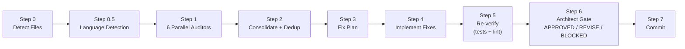

<p align="center">
  
</p>

# CCA-Audit

**Parallel multi-agent code audit + fix pipeline for [Claude Code](https://docs.anthropic.com/en/docs/claude-code).**

CCA-Audit runs specialized auditors in parallel on your codebase, deduplicates findings, auto-fixes critical issues, re-verifies, and gates the result through an architect review -- all in one command.

Two pipelines ship: **`/audit-fix`** (fast, 6 auditors) and **`/audit-fix-v2`** (up to 9 auditors plus anti-hallucination, anti-regression, and fix→finding verification gates).

Works with **any language** (Python, TypeScript, Go, Rust, Java, Ruby) via auto-detection.

## Pipeline



### The 6 Auditors

Each auditor has a **non-overlapping scope** -- no duplicate findings:

| Auditor | Scope | Does NOT Check |
|---------|-------|----------------|
| **Code Quality** | Type safety, DRY, complexity, naming, dead code | Security, runtime bugs, performance |
| **Bug Scanner** | Null refs, error handling, race conditions, resource leaks | Security vulns, code style |
| **Security** (single authority) | OWASP Top 10, injection, auth, secrets, CVEs | Runtime bugs, code quality |
| **Performance** | Slow queries, hot paths, memory, connection pools | Security, code style |
| **Documentation** | Missing docs, stale comments, type annotations | TODOs, debug statements |
| **Environment** | Config completeness, format validation, naming | Secrets (owned by Security) |

Plus support agents: **Dependency Auditor** (maintenance health, licenses, unused deps) and **Fix Planner** (dedup + prioritization). `/audit-fix-v2` adds 3 more — **High-Stakes/Safety**, **Numerical/Units**, and **Data-Integrity** auditors — and two verification agents (**fp-check**, **differential-review**).

## Install

Drop-in agents for [Claude Code](https://docs.anthropic.com/en/docs/claude-code). One command installs, one slash command runs.

```bash
# Install into your project's .claude/ directory
curl -fsSL https://raw.githubusercontent.com/GiulioDER/cca-audit/master/claude-code/install.sh | bash
```

This copies the command files into `.claude/commands/` and the agents into `.claude/agents/`.
See the [Claude Code README](claude-code/README.md) for Windows/PowerShell install and details.

## Two Pipelines: v1 and v2

Both ship; pick depth per task.

### `/audit-fix` (v1) — fast default, 6 auditors

```
/audit-fix              # Round 1: audit + fix P1+P2, defer P3
/audit-fix deferred     # Round 2: fix deferred P3 items from previous round
/audit-fix no-fix       # audit only, no fixes
/audit-fix p1-only      # fix only critical findings
/audit-fix commit 3     # audit last 3 commits
/audit-fix files src/app.py   # audit specific files
```

### `/audit-fix-v2` — thorough, up to 9 auditors + 3 verification gates

v2 adds, on top of v1:
- **3 conditional domain auditors** — high-stakes/safety, numerical/units, data-integrity — dispatched only when the diff touches those concerns.
- **L2.5 anti-hallucination gate** — every P1/P2 finding is re-verified against the real code before any fix (false positives dropped, uncertain ones escalated).
- **L5.5 anti-regression gate** — a differential review confirms the fix diff changed nothing beyond each finding's intent.
- **L6 fix→finding mapping** — the architect gate must map every confirmed finding to its fix; an orphan P1 or a phantom fix forces a REVISE.

```
/audit-fix-v2           # full 9-auditor pipeline with verification gates
/audit-fix-v2 no-fix    # audit + verify only, no fixes
/audit-fix-v2 deferred  # second pass for deferred P3 items
```

**Which to use?** Default to **v1** for everyday changes. Reach for **v2** on high-stakes diffs
(money, auth, data migrations, numeric/units-heavy code) or when you want findings independently
verified before they're acted on.

## Priority Framework

Both pipelines use the same 3-tier priority system:

| Priority | Criteria | Action |
|----------|----------|--------|
| **P1 Critical** | Security vulns, data corruption, auth bypass, injection | Fix before deploy |
| **P2 High** | DRY divergence risk, stale misleading comments, config inconsistencies | Fix now |
| **P3 Nice-to-have** | Cosmetic, style, naming, unused params | Deferred to Round 2 |

## Two-Pass Workflow

CCA-Audit is designed for a clean two-pass close-out:

1. **Round 1** (`/audit-fix`): runs the full audit, fixes P1 Critical + P2 High, defers P3 cosmetic items. Commits with a structured message listing deferred items.
2. **Round 2** (`/audit-fix deferred`): reads the deferred list from the previous commit, checks each item is still relevant, fixes what remains, marks stale items. Commits separately.

(`/audit-fix-v2` follows the same two-pass shape with `/audit-fix-v2 deferred`.)

This ensures every audit is fully closed out -- no lingering deferred items across PRs.

## Documentation

- [Pipeline Diagram](docs/pipeline-diagram.md) -- detailed walkthrough of each step
- [Auditor Scopes](docs/auditor-scopes.md) -- full non-overlapping scope matrix
- [Configuration](docs/configuration.md) -- all config options
- [Extending](docs/extending.md) -- how to add custom auditors

## License

[MIT](LICENSE)
