<p align="center">
  
</p>

<p align="center">
  <a href="https://github.com/GiulioDER/cca-audit/actions/workflows/ci.yml"></a>
  
  
  <a href="https://github.com/GiulioDER/cca-audit/blob/master/LICENSE"></a>
</p>

# CCA-Audit

**A multi-agent code auditor for [Claude Code](https://docs.anthropic.com/en/docs/claude-code) in which no finding reaches your code unverified.**

Eleven specialised auditors read your diff in parallel. Their findings are deduplicated, then each one is
**re-derived against the real code** — mechanically, by `pyright`, `clippy`, `semgrep`, `pytest` or
`hypothesis` wherever a tool can settle the claim, and by adversarial review where none can. Only
findings that survive that gate are eligible to be fixed. The fix is then checked for scope creep,
and the whole change is gated on a mapping proving every confirmed finding has a fix and every edit
has a finding.

**Python and Rust** have deterministic settlers. Each language gets the claim vocabulary that
actually carries information in it — Rust does not get `nullability`, because the code compiled;
it gets `panic_path`, `overflow` and `error_swallow` instead. Any other language, and any claim type
a backend does not declare, escalates rather than being settled by a tool built for something else.

The design constraint throughout: **a check that could not run must never be indistinguishable from a
check that passed.**

---

## Verified in the field

Two upstream results, both from [hunt mode](#hunt-mode--auditing-code-you-did-not-write), both
checkable in under a minute.

### SciPy — merged upstream

Hunt mode was pointed at [scipy/scipy](https://github.com/scipy/scipy) (~14.8k stars) and found a
copy-paste defect in `signal.decimate`'s complex-coefficient guard:

```python
elif (any(np.iscomplex(system.poles))
      or any(np.iscomplex(system.poles))   # <- should be system.zeros
      or np.iscomplex(system.gain)):
```

> The guard exists to route complex-coefficient filters away from `zpk2sos`, which cannot represent
> them. Because it tested the poles twice and never the zeros, a `dlti` filter with **real poles and
> complex zeros** was not recognised as complex, was forced through `zpk2sos`, and raised
> `ValueError: complex value with no matching conjugate` on valid input.

| | |
|---|---|
| Submitted upstream | [PR #25654](https://github.com/scipy/scipy/pull/25654), 18 Jul 2026 |
| Merged | 23 Jul 2026 by a SciPy maintainer — approved *"LGTM"*, labelled `defect` |
| What shipped | the one-line fix **and our regression test**, `test_complex_zeros_real_poles_iir_dlti` |
| Latent for | ~3 years 3 months — introduced by [gh-17881](https://github.com/scipy/scipy/pull/17881) (Apr 2023) |

The defect is sharper than its one-line diff suggests: gh-17881 was itself titled *"Fix handling on
user-supplied filters in `signal.decimate`"* and added complex-filter support. The typo silently
defeated half of the feature that PR shipped — complex *poles* worked, complex *zeros* crashed — and
survived review, three years of releases, and the surrounding test suite, which covered the working
half only. It is still live in the current release, 1.18.0.

**To be precise about what that means:** the fix was ours and it was merged into a core scientific
library after maintainer review. What we did *not* do is submit it autonomously — SciPy's
[AI policy](https://github.com/scipy/scipy/blob/main/doc/source/dev/conduct/ai_policy.rst) requires a
human to check generated code and open the PR, and requires the PR prose to be the contributor's own
words. Both were honoured, and the AI-assistance disclosure is in the PR body.

### Polymarket py-sdk — reported, fixed by the maintainers

Hunt mode was pointed at [Polymarket/py-sdk](https://github.com/Polymarket/py-sdk) — a third-party
SDK, ~70 stars, actively maintained — and found a client-side price-validation defect:

> `_resolve_price` and `_resolve_protected_market_price` validated prices by **decimal-place count**
> rather than **tick-grid membership**. The two agree on power-of-ten ticks and diverge on `0.005`
> and `0.0025` markets, where a price like `0.007` has three decimals, passes validation, is signed
> into the EIP-712 order, and is only then rejected by the exchange.

| | |
|---|---|
| Reported upstream | [issue #162](https://github.com/Polymarket/py-sdk/issues/162), 14 Jul 2026 |
| Fixed upstream | [PR #181](https://github.com/Polymarket/py-sdk/pull/181), merged 21 Jul 2026 — body states *"Fixes #162"* |
| Author of the fix | a Polymarket maintainer, independently |
| Issue status | closed as **completed** |

**To be precise about what that means:** here the upstream fix was written by a Polymarket
maintainer, not submitted by us — an outside bug report was specific enough that the maintainers
implemented and shipped it themselves.

How the finding survived to that point: `/audit-fix hunt` surfaced four candidates; the adversarial
2-of-3 verifier **killed the flashiest one** (already fixed in an open upstream PR) and one
deliberate-by-design finding; the survivor was reproduced against ~23,000 exhaustive price/tick cases
before a line was written.

Neither result was cherry-picked from a benchmark: both targets were third-party repos nobody here
wrote, and in both cases the finding had to survive the same adversarial gate before it left the
machine.

## It audits itself, and the self-audit finds things

The most recent release, `v3.5`, shipped through five task reviews and a whole-branch review. CCA was
then pointed at it. It found **two Critical defects that the entire review process had missed**:

- **CI had never executed the feature's test suite.** The workflow installed an extra that omitted
  `mpmath`; both test files `importorskip` it, so ~25 tests — including the integrity gate, the
  feature's central safety guarantee — skipped silently on all four Python versions. `2 skipped`
  became `31 passed`.
- **One environment variable made correct code confirm as defective.** `CCA_SUBSTRATE_TOL=1e-20` drove
  the deliberately-correct test fixture to raise a violation at a measured relative error of `8.3e-18`
  — ordinary float64 noise. That verdict would have been binding: protected from being overturned,
  exempt from the adversarial panel, and feeding an automated fix plan.

Both were confirmed by execution rather than by re-reading, and both now carry red→green regression
tests. The full round is [PR #22](https://github.com/GiulioDER/cca-audit/pull/22).

## What is actually different

Multi-agent review is common. These parts are not:

**Mechanical verification, not a second opinion.** A finding is classified into a *claim type* and
settled by the tool that can actually decide it — `pyright` for definedness/nullability/type,
`semgrep` for taint, a `pytest` repro for crash impact, `hypothesis` for arithmetic. The verdict
carries a machine-produced artifact. An LLM may not overturn an artifact-backed verdict; it
adjudicates only what no tool could settle.

**Asymmetric verdicts, stated honestly.** Each settler can only conclude what its evidence supports.
`semgrep` can prove a sink is absent but never that an injection is real. The numeric checker can
confirm with a falsifying example but never refute, because a property holding across a bounded
search is the absence of a counterexample, not proof of correctness. A clean run is `UNCERTAIN`, not
a green pass.

**Anti-regression on the fix itself.** After fixes land, a differential pass verifies each hunk maps
to its finding and introduced no behaviour change beyond it. Scope creep and regression risk are
kicked back.

**Fix→finding mapping as a merge gate.** The architect gate emits a table proving every confirmed
finding has a fix and every edit traces to a finding. An orphan finding or a phantom edit forces
REVISE.

**Risk-tiered, not user-tiered.** Trivial diffs run cheap; money, auth, and numeric diffs are forced
to the full adversarial treatment. You do not choose the tier by asserting your change is safe.

## Honest limits

A verification tool that cannot state where it is blind is asking for trust it has not earned. These
are enforced as **tests**, not disclaimers:

- **The numeric substrate check cannot see sign or formula errors.** It is decorrelated on
  *evaluation* and correlated on *transcription*: both substrates faithfully compute whatever
  structure was written down, so a flipped sign survives into both and they agree. That class belongs
  to the property helpers. `test_sign_trap_does_not_violate` asserts this.
- **Its integrity gate proves the returned value, not every intermediate.** A target that delegates to
  an unpatched second module can return a high-precision-typed value carrying float64 precision.
  Measured: the gate passes a reference of `0.0` where the true answer is `0.5`.
  `test_gate_does_not_catch_cross_module_precision_loss` asserts this.
- **A property is authored by the same agent that raised the finding**, so a wrong declared relation
  produces a real counterexample to a wrong claim. A confirmation obliges you to re-read the relation,
  not just the verdict.
- **Deterministic coverage is per-language, and a language without a backend gets none.** Ask the
  tool rather than trusting this table — `python -m cca_checks capabilities --file <F>` reports what
  it can settle *on your machine*, including which tools are missing.

  | | settled deterministically | by |
  |---|---|---|
  | **Python** | `definedness` · `nullability` · `type` · `taint` · `clock_leak` | `ast` + `pyright` + `semgrep` |
  | **Rust** | `clock_leak` · `panic_path` · `overflow` · `error_swallow` · `unsafe_op` · `taint` | tree-sitter + `clippy` + `semgrep` |
  | **everything else** | nothing — every claim escalates to LLM adjudication | — |

  A claim about a file no backend covers, or a claim type the covering backend does not declare,
  returns `UNCERTAIN` before any checker runs. It cannot be refuted by a tool built for another
  language: `test_language_guard.py` asserts this over every claim type.

- **Rust does not get `definedness`, `type` or `nullability`, and that is not a gap.** Those defects
  do not survive to review in a language that compiled — the name resolved, the types checked, and
  `Option` is not a nullable pointer. Porting them would have doubled the claim vocabulary while
  refuting almost everything by construction.

- **The Rust clock check reads syntax, not semantics.** tree-sitter does not expand macros. A clock
  read inside a `macro_rules!` body is invisible to it, as is one reaching the file through a glob
  `use`. Both therefore **block refutation** rather than being ignored — a file must not earn a
  `FALSE_POSITIVE` carrying an authoritative `source` precisely by being hard to read.
  `test_clock_check_rust.py` asserts both.

- **clippy needs the crate to build.** A crate that does not compile produces no lint diagnostics at
  all, which reads exactly like a clean crate — so an un-buildable crate is `UNCERTAIN` everywhere,
  never a refutation. `test_clippy_check.py::test_a_stream_that_proves_nothing_returns_none` asserts
  the whole cascade.

- **Release-mode wrapping overflow is not provable by a debug test.** Rust panics on overflow in
  debug and wraps silently in release; a `cargo test` artifact can only demonstrate the first. The
  second is the more dangerous half and is disclosed rather than claimed.

- **A `panic_path` or `unsafe_op` finding can never be CONFIRMED by clippy.** A lint sees the
  construct, not whether it is reachable with a value the caller controls — `.unwrap()` on a value
  built two lines above is correct code. Those two mirror `taint`: they refute a false premise and
  inform adjudication, and a confirmation has to come from a repro that actually panics.

## Pipeline

```mermaid
flowchart LR
    A["Step 0\nDetect Files"] --> B["Step 0.5\nLanguage + Domain"]
    B --> T["Step 0.6\nTier Select\nFAST/STANDARD/DEEP"]
    T --> C["Step 1\nParallel Auditors"]
    C --> D["Step 2\nConsolidate + Dedup"]
    D --> V["Step 2.5\nVerify findings\n(anti-hallucination)"]
    V --> E["Step 3\nFix Plan"]
    E --> F["Step 4\nImplement\n(P1 red→green)"]
    F --> G["Step 5\nRe-verify\n(tests + lint)"]
    G --> R["Step 5.5\nRegression Diff\n(anti-regression)"]
    R --> H["Step 6\nArchitect Gate\n+ fix→finding map"]
    H --> I["Step 7\nCommit"]
```



FAST runs three core auditors and skips the regression gate — but still verifies every P1 before
fixing it. **No finding is edited into your code unverified, on any tier.**

## The auditors

Each has a **non-overlapping scope**, so findings do not duplicate and no auditor arbitrates another's
domain.

**Core** (FAST runs only the first three):

| Auditor | Scope | Does NOT check |
|---------|-------|----------------|
| **Security** *(single authority)* | OWASP Top 10, injection, auth, secrets, CVEs | Runtime bugs, code quality |
| **Bug** | Null refs, error handling, races, resource leaks | Security, style |
| **Code Quality** | Type safety, DRY, complexity, naming, dead code | Security, runtime, performance |
| **Performance** | Slow queries, hot paths, memory, pooling | Security, style |
| **Documentation** | Missing docs, stale comments contradicting new code | TODOs, debug statements |
| **Environment** | Config completeness, format validation, naming | Secrets *(Security owns those)* |

**Conditional**, dispatched only when the diff touches their concern:

| Auditor | Runs when | Checks |
|---------|-----------|--------|
| **High-Stakes / Safety** | money / auth / delete / irreversible paths | Bounds, guards, kill-switches, idempotency |
| **Numerical / Units** | non-trivial arithmetic | Sign, units, scaling, rounding, conversions |
| **Data-Integrity** | migrations / SQL / schema | Migration+grant, type assumptions, safe accessors |
| **Dependency** | a manifest or lockfile changed | Maintenance health, licences, unused deps, pin breakers |
| **Deployability** | deployable code / units / migrations | Generated files, pin/lock breakers, service↔scheduler pairing, deploy-target assumptions |

Plus the verification agents: **fp-check** (anti-hallucination), **differential-review**
(anti-regression), and the read-only **architect-reviewer** final gate.

## Hunt mode — auditing code you did not write

`/audit-fix` reviews *your* diff. **Hunt mode** turns the same pipeline on a codebase you did not
write — a dependency, a repo you are evaluating, a legacy service — to find pre-existing defects:

```
/audit-fix hunt src/payments        # a whole subtree, no diff required
/audit-fix hunt path/to/file.py     # or specific files
```

What changes:

- **Whole-file audit.** *"Pre-existing bugs are the target"* replaces *"only audit the diff."* Age is
  not evidence of correctness.
- **A target-viability pre-flight runs first**, before a single auditor is spawned: is the repo alive,
  does it accept contributions, is there a test harness, is the language one this pipeline audits
  well. An archived or deprecated repo is rejected up front — auditing a corpse burns the run and
  produces a fix nobody can merge.
- **Forced DEEP tier**, so every finding faces the adversarial 2-of-3 verifier.
- **Upstream-duplicate check.** L2.5 searches the target's own issues and PRs; a bug someone already
  reported is dropped as `DUPLICATE` rather than re-submitted.

The output is a finding you can stand behind: reproduced with a failing test, not already known
upstream, and survivable under adversarial review. That is the process that produced both
[field results](#verified-in-the-field) above — the merged SciPy fix and the Polymarket report.

## Install

```bash
pip install cca-audit
cca-audit install          # run from the root of the project you want to audit
```

That copies the auditor agents into `.claude/agents/` and `/audit-fix` into `.claude/commands/`, and
puts the `cca_checks` verifier (`python -m cca_checks`) on the same interpreter. Re-run
`cca-audit install` to upgrade — files you have customized are preserved as `<name>.md.bak` rather
than overwritten.

<details>
<summary>Install without pip (shell script, requires git)</summary>

```bash
# Unix/macOS
curl -fsSL https://raw.githubusercontent.com/GiulioDER/cca-audit/master/claude-code/install.sh | bash
```

```powershell
# Windows PowerShell
irm https://raw.githubusercontent.com/GiulioDER/cca-audit/master/claude-code/install.ps1 | iex
```

Same result: it clones the repo to a temp directory and copies the same files. Both paths read the
markdown from `cca_checks/plugin/`, so there is one copy on disk and they cannot drift.
</details>

**For the deterministic verification layer**, have `pyright`, `pytest` and `semgrep` on your `PATH`.
Without them the `definedness` / `nullability` / `type` / `taint` claim types fall back to LLM-only
verification — no crash, no regression.

**`numeric` is the exception: it fails closed rather than falling back.** On DEEP, a `NUM-*` P1 may
not enter the fix plan on an LLM-sourced verdict — it carries a Hypothesis artifact or it is escalated
as `UNCERTAIN`. DEEP is forced for every high-stakes or numeric diff and for all of hunt mode, so
**without the `numeric` extra, arithmetic findings on money-path code cannot be auto-fixed at all.**
That is deliberate — a sign error reads fluently, so a second LLM opinion is not evidence — but it is
a hard stop, not graceful degradation.

The extras carry it:

```bash
pip install 'cca-audit[verify]'    # the whole deterministic layer in one install
pip install 'cca-audit[numeric]'   # just hypothesis + mpmath + pytest
pip install 'cca-audit[rust]'      # just the tree-sitter Rust grammar
```

From a clone, the editable equivalents are `pip install -e ".[verify]"` / `-e ".[numeric]"`.

`pyright`, `semgrep` and the Rust toolchain are **not** pip extras: the first two install
separately, and `cargo`/`clippy` belong to the project you are auditing. Check what you actually
have with `python -m cca_checks capabilities --file <a source file>` — it names the missing tool for
any claim type it cannot settle here, rather than leaving you to infer it from an escalation.

Worked example: [`examples/sign-trap`](https://github.com/GiulioDER/cca-audit/tree/master/examples/sign-trap) — a real sign error, the property that
catches it, and the resulting artifact.

## Usage

```
/audit-fix                 # audit + fix uncommitted changes (tier auto-selected)
/audit-fix deferred        # second pass: fix P3 items deferred by the previous round
/audit-fix no-fix          # audit + verify only
/audit-fix p1-only         # fix only P1 Critical findings
/audit-fix fast | deep     # override the auto-selected tier
/audit-fix commit 3        # audit the last 3 commits
/audit-fix files src/app.py
/audit-fix hunt src/       # audit code you did NOT write
```

You normally do not pick a tier — the pipeline does.

| Tier | When (auto) | Auditors | Verification gates | P1 fix style |
|------|-------------|----------|--------------------|--------------|
| **FAST** | trivial, low-stakes, non-deploy diff | 3 core | L2.5 on P1 only | direct |
| **STANDARD** | normal diff | all 6 core + conditional | L2.5 + L5.5 + mapping | red→green test |
| **DEEP** | high-stakes / numeric / hunt / forced | all of STANDARD | + adversarial 2-of-3 on high-stakes P1 | red→green test |

| Priority | Criteria | Action |
|----------|----------|--------|
| **P1 Critical** | Security, data corruption, auth bypass, injection, unsafe money/irreversible handling | Fix before deploy, with a red→green test |
| **P2 High** | DRY divergence, stale misleading comments, config inconsistencies, unit mismatches | Fix now |
| **P3** | Cosmetic, style, naming, unused params | Deferred to round 2 |

Round 2 (`/audit-fix deferred`) reads the deferred list from the previous commit, re-checks each item
is still relevant, fixes what remains and marks the rest stale — so no audit leaves a tail.

## Engineering

| | |
|---|---|
| Tests | 613, on every push and PR |
| Python | 3.10, 3.11, 3.12, 3.13 — full matrix in CI |
| Packaging | wheel built and smoke-installed into a clean venv in CI |
| Lint | `ruff`, zero warnings |
| Types | `pyright` |
| Design of record | [`docs/v3-design.md`](https://github.com/GiulioDER/cca-audit/blob/master/docs/v3-design.md), versioned slices v3.0 → v3.6 |

Every deterministic-verification slice ships with a written spec and an implementation plan under
[`docs/superpowers/`](https://github.com/GiulioDER/cca-audit/tree/master/docs/superpowers), including the measured dead ends — approaches that were
tried, failed, and are recorded so they are not re-attempted.

## Documentation

- [Pipeline Diagram](https://github.com/GiulioDER/cca-audit/blob/master/docs/pipeline-diagram.md) — a walkthrough of each step
- [Auditor Scopes](https://github.com/GiulioDER/cca-audit/blob/master/docs/auditor-scopes.md) — the full non-overlapping scope matrix
- [Configuration](https://github.com/GiulioDER/cca-audit/blob/master/docs/configuration.md) — tiers, domain dispatch, project context
- [Extending](https://github.com/GiulioDER/cca-audit/blob/master/docs/extending.md) — adding a custom auditor
- [v3 Design](https://github.com/GiulioDER/cca-audit/blob/master/docs/v3-design.md) — the design of record for the deterministic verification layer
- [Security Policy](https://github.com/GiulioDER/cca-audit/blob/master/SECURITY.md) — **this tool executes code from the repository under audit**
- [Changelog](https://github.com/GiulioDER/cca-audit/blob/master/CHANGELOG.md) · [Contributing](https://github.com/GiulioDER/cca-audit/blob/master/CONTRIBUTING.md)

**Writing**

- [Fluency isn't evidence](https://github.com/GiulioDER/cca-audit/blob/master/docs/blog-fluency-isnt-evidence.md) — why a sign error survives review, and how a counterexample settles it
- [Why AI code review hallucinates](https://github.com/GiulioDER/cca-audit/blob/master/docs/blog-why-ai-review-hallucinates.md) — and the two gates that close it
- [The benchmark memorization gap](https://github.com/GiulioDER/cca-audit/blob/master/docs/blog-benchmark-memorization-gap.md) — what a passing benchmark score actually measures

## License

[MIT](https://github.com/GiulioDER/cca-audit/blob/master/LICENSE)
