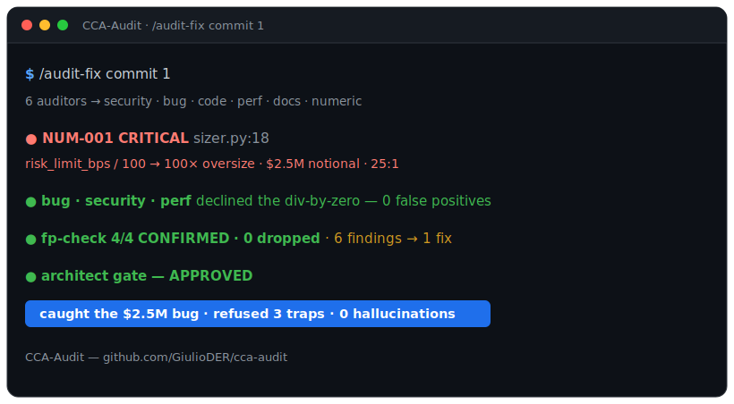

<p align="center">
  
</p>

# CCA-Audit

**The multi-agent code auditor for [Claude Code](https://docs.anthropic.com/en/docs/claude-code) that doesn't cry wolf.**

Every AI reviewer has the same problem: it hallucinates. It flags a null-deref that's guarded three lines up, "fixes" things that were never broken, and buries the one bug that actually matters under a pile of noise. CCA-Audit is built to do the opposite — it **verifies every finding against your real code before it touches a line**, so it catches the expensive bug *and* stays quiet about the fake ones.

One command — `/audit-fix` — runs specialized auditors in parallel on your changed code, deduplicates their findings, **verifies each one against the real code (anti-hallucination gate)**, auto-fixes what's confirmed, re-verifies, checks the fix introduced no regression, and gates the result through an architect review. Any language, auto-tiered by how risky the diff is.

## Field results — real bugs, real repos

Not a rigged demo. This is a bug CCA's [hunt mode](#hunt-mode--audit-code-you-didnt-write) found in third-party code it never wrote:

| Repo | Bug it found | Impact | Evidence |
|------|--------------|--------|----------|
| **[Polymarket/py-sdk](https://github.com/Polymarket/py-sdk)** &nbsp;·&nbsp; ⭐ 70, active | Client-side price validation checked decimal **places**, not **tick-grid membership**. On a `0.005` / `0.0025` half-tick market an off-grid price like `0.007` passed validation, got EIP-712 **signed**, and could only be rejected downstream by the exchange. Present in *both* the limit and market price paths. | Silent rejection of real-money orders | fix **[merged — PR #1](https://github.com/GiulioDER/py-sdk/pull/1)** · reported upstream: **[issue #162](https://github.com/Polymarket/py-sdk/issues/162)** |

**How it got there:** `/audit-fix hunt` surfaced 4 candidates; the adversarial 2-of-3 verifier **killed the flashiest one** (already fixed in an open upstream PR) and one deliberate-by-design finding, leaving a single bug that survived scrutiny — then reproduced it against **~23,000 exhaustive price/tick cases** (zero false accepts, zero false rejects) *before a line was written*.

> **Straight about the links:** upstream `py-sdk` accepts issues but locks pull requests to collaborators, so the fix is merged in a **fork** (PR #1) and the bug is filed **upstream as an issue** (#162) — not merged into Polymarket. Both are live links; check them.

## See it work

We planted **one subtle, money-losing bug** in a position sizer — `risk_limit_bps / 100` where basis points require `/ 10_000`, a **100× over-size** that a green test suite sails right past — plus **three false-positive traps** designed to bait a lazy reviewer (a guarded division, a cross-file guard, an off-diff config key).

CCA caught the money bug and **refused all three traps:**

<!-- Swap in the animated recording at docs/demo.gif when ready -->
<p align="center">
  
</p>
<p align="center"><sub><strong>&#9654; animated:</strong> open <a href="docs/demo.html"><code>docs/demo.html</code></a> &nbsp;&#183;&nbsp; <strong>full run + real transcripts:</strong> <a href="https://github.com/GiulioDER/cca-audit/blob/demo/bps-sizing/examples/bps-sizing/DEMO.md">the case study</a></sub></p>

- 🎯 **Caught** `NUM-001` (Critical): the 100× sizing bug → **$2,500,000 notional on a $100k account (25:1 leverage)** — while the smoke test stayed green.
- 🛡️ **Refused every false positive** — the bug, security, and performance auditors each looked straight at the "possible `ZeroDivisionError`" and *declined it* after tracing the validator. Zero hallucinations across the whole fan-out.
- 🧮 **Self-corrected** — the verification gate re-derived an overstated impact figure *before* any fix was applied.
- ✂️ **Deduped** 6 raw findings into a **single one-line fix**, then proved it (tests green, architect **APPROVED**).

**Reproduce it yourself** — full walkthrough + the real, unedited agent transcripts:
→ [the case study](https://github.com/GiulioDER/cca-audit/blob/demo/bps-sizing/examples/bps-sizing/DEMO.md) · [the receipts](https://github.com/GiulioDER/cca-audit/blob/demo/bps-sizing/examples/bps-sizing/RECEIPTS.md)

```bash
git clone -b demo/bps-sizing https://github.com/GiulioDER/cca-audit
# install (see below), then in Claude Code, from the repo root:
/audit-fix commit 1
```

## What makes it different

Multi-agent review is table stakes now. These parts aren't:

- **Anti-hallucination gate (`fp-check`)** — every P1/P2 finding is re-checked against the actual code *before* it's eligible to be fixed. False positives are dropped **with evidence**; overstated impacts get corrected. Biased to refute.
- **Anti-regression gate (`differential-review`)** — after fixes, a differential pass confirms the fix diff changed **nothing** beyond the intent of each finding.
- **Fix→finding mapping** — the architect gate emits a table proving every confirmed finding maps to a fix and every change maps to a finding. An orphan finding or a phantom edit forces a revise.
- **Non-overlapping auditor scopes** — security is the single authority for security, numeric owns units/sign, etc. No duplicate findings, no turf wars.
- **Risk-tiered** — trivial diffs stay cheap; money / auth / numeric diffs automatically get the full adversarial treatment.

And it isn't limited to your own diffs. **Hunt mode** (`/audit-fix hunt <paths>`) turns the whole pipeline on a codebase you did **not** write — an OSS dependency, a repo you're evaluating — to find pre-existing bugs, with a target-viability pre-flight that refuses to audit an archived or dead repo. See [Hunt Mode](#hunt-mode--audit-code-you-didnt-write).

## Pipeline

```mermaid
flowchart LR
    A["Step 0\nDetect Files"] --> B["Step 0.5\nLanguage + Domain"]
    B --> T["Step 0.6\nTier Select\nFAST/STANDARD/DEEP"]
    T --> C["Step 1\nParallel Auditors"]
    C --> D["Step 2\nConsolidate + Dedup"]
    D --> V["Step 2.5\nVerify findings\n(anti-hallucination)"]
    V --> E["Step 3\nFix Plan"]
    E --> F["Step 4\nImplement\n(P1 red→green)"]
    F --> G["Step 5\nRe-verify\n(tests + lint)"]
    G --> R["Step 5.5\nRegression Diff\n(anti-regression)"]
    R --> H["Step 6\nArchitect Gate\n+ fix→finding map"]
    H --> I["Step 7\nCommit"]
```



(FAST tier runs only the 3 core auditors and skips the regression gate — but it still verifies every
P1 before fixing it. No finding is edited into your code unverified, on any tier.)

## The Auditors

Each auditor has a **non-overlapping scope** — no duplicate findings.

**Core (always run; FAST runs only the first three):**

| Auditor | Scope | Does NOT Check |
|---------|-------|----------------|
| **Security** (single authority) | OWASP Top 10, injection, auth, secrets, CVEs | Runtime bugs, code quality |
| **Bug Scanner** | Null refs, error handling, race conditions, resource leaks | Security vulns, code style |
| **Code Quality** | Type safety, DRY, complexity, naming, dead code | Security, runtime bugs, performance |
| **Performance** | Slow queries, hot paths, memory, connection pools | Security, code style |
| **Documentation** | Missing docs, stale comments, type annotations | TODOs, debug statements |
| **Environment** | Config completeness, format validation, naming | Secrets (owned by Security) |

**Conditional (dispatched only when the diff touches their concern):**

| Auditor | Runs when | Checks |
|---------|-----------|--------|
| **High-Stakes / Safety** | money / auth / delete / irreversible paths | Bounds, guards, kill-switches, idempotency |
| **Numerical / Units** | non-trivial arithmetic | Sign, units, scaling, rounding, conversions |
| **Data-Integrity** | migrations / SQL / schema | Migration+grant, type assumptions, safe accessors |
| **Dependency** | a manifest/lockfile changed | Maintenance health, licenses, unused deps, pin breakers |
| **Deployability** | deployable code / units / migrations | Generated/protected files, pin/lock breakers, service↔scheduler pairing, migration grants, deploy-target assumptions |

Plus verification agents: **fp-check** (anti-hallucination) and **differential-review** (anti-regression), and the **architect-reviewer** final gate (read-only).

## Install

Drop-in agents for [Claude Code](https://docs.anthropic.com/en/docs/claude-code). One command installs, one slash command runs.

```bash
# Unix/macOS — install into your project's .claude/ directory (requires git)
curl -fsSL https://raw.githubusercontent.com/GiulioDER/cca-audit/master/claude-code/install.sh | bash
```

```powershell
# Windows PowerShell (requires git)
irm https://raw.githubusercontent.com/GiulioDER/cca-audit/master/claude-code/install.ps1 | iex
```

This copies the commands into `.claude/commands/`, the agents into `.claude/agents/`, and installs the **`cca_checks`** helper package (`python -m cca_checks`) that powers the deterministic verifier. Run it from the root of the project you want to audit.

**For the deterministic verification layer**, also have `pyright`, `pytest`, and `semgrep` on your `PATH` (`pip install pyright pytest semgrep`). Without `cca_checks` or those tools, the `definedness` / `nullability` / `type` / `taint` claim types **fall back to LLM-only verification** — no crash, no regression. See the [Claude Code README](claude-code/README.md) for local-clone install and details.

**`numeric` is the exception: it fails closed rather than falling back.** On the DEEP tier a `NUM-*`
P1 may not enter the fix plan on an LLM-sourced verdict — it carries a Hypothesis artifact or it is
escalated as UNCERTAIN. DEEP is forced for every high-stakes or numeric diff and for all of hunt
mode, so **without the `numeric` extra, arithmetic findings on money-path code cannot be auto-fixed
at all.** That is deliberate — a sign error reads fluently, so a second LLM opinion is not evidence —
but it is a hard stop, not a graceful degradation. Install it from a clone:

```bash
pip install -e ".[numeric]"
```

`cca_checks` is not published on PyPI, so `pip install "cca_checks[numeric]"` will not resolve; use
the editable install above, or `pip install "<path-to-clone>[numeric]"`. The extra adds the `numeric`
claim type, which settles arithmetic defects — wrong sign, mixed units, bad scaling — by running
declared metamorphic properties under Hypothesis. It confirms with a falsifying example and never
refutes, because properties holding is not proof of correctness. Worked example:
[`examples/sign-trap`](examples/sign-trap/).

## Usage

One command, auto-tiered:

```
/audit-fix                 # audit + fix all uncommitted changes (tier auto-selected)
/audit-fix deferred        # second pass: fix deferred P3 items from the previous round
/audit-fix no-fix          # audit + verify only, no fixes
/audit-fix p1-only         # fix only P1 Critical findings
/audit-fix fast            # force the cheap 3-auditor tier
/audit-fix deep            # force the full tier (all domain auditors + adversarial verify)
/audit-fix commit 3        # audit the last 3 commits
/audit-fix files src/app.py
/audit-fix hunt src/       # HUNT MODE: audit code you did NOT write for pre-existing bugs
```

You normally don't pick a tier — the pipeline does. High-stakes/numeric diffs always run **DEEP**; trivial low-stakes diffs run **FAST**; everything else runs **STANDARD**. Use `fast` / `deep` only to override.

> `/audit-fix-v2` is kept as a backward-compatible alias that forces the **DEEP** tier. The old
> v1/v2 split has been merged into this one tiered pipeline.

## Hunt Mode — audit code you didn't write

`/audit-fix` normally reviews *your* diff. **Hunt mode** turns the same pipeline on a codebase you did
**not** write — an OSS dependency, a repo you're evaluating, a legacy service — to find **pre-existing**
bugs that ship today:

```
/audit-fix hunt src/payments        # audit a whole subtree, no diff required
/audit-fix hunt path/to/file.py     # or specific files
```

What changes in hunt mode:

- **Whole-file audit, no diff.** Auditors read each file in full; *"pre-existing bugs are the target"*
  replaces *"only audit the diff."*
- **A target-viability pre-flight runs first.** Before spawning a single auditor it checks the repo is
  alive, accepts contributions, has a test harness, and is in a language it audits well. An archived
  or deprecated repo is **rejected up front** — auditing a corpse wastes the whole run and produces a
  fix nobody can merge.
- **Forced DEEP tier.** Every finding faces the adversarial 2-of-3 verifier, so a plausible-but-wrong
  finding gets killed before you act on it.
- **Upstream-duplicate check.** L2.5 searches the target's own issues and PRs; a bug someone already
  reported is dropped as a `DUPLICATE`, not re-submitted.

The result is a bug you can stand behind: reproduced with a failing test, not already known upstream,
and survivable under an adversarial review — exactly what you need before opening a PR against someone
else's project.

## Tiers

| Tier | When (auto) | Auditors | Verification gates | P1 fix style |
|------|-------------|----------|--------------------|--------------|
| **FAST** | trivial, low-stakes, non-deploy diff | security, bug, code | L2.5 on P1 only (P2/P3 reported, not fixed) | direct |
| **STANDARD** | normal diff | all 6 core + conditional domain/dep/deploy | L2.5 + L5.5 + mapping | red→green test |
| **DEEP** | high-stakes / numeric / forced | all of STANDARD | + **adversarial 2-of-3** on high-stakes P1 | red→green test |

## Priority Framework

| Priority | Criteria | Action |
|----------|----------|--------|
| **P1 Critical** | Security vulns, data corruption, auth bypass, injection, unsafe money/irreversible handling | Fix before deploy (with a red→green regression test) |
| **P2 High** | DRY divergence risk, stale misleading comments, config inconsistencies, unit mismatches | Fix now |
| **P3 Nice-to-have** | Cosmetic, style, naming, unused params | Deferred to Round 2 |

## Two-Pass Workflow

1. **Round 1** (`/audit-fix`): full audit, fixes P1 Critical + P2 High, defers P3 cosmetic items. Commits with a structured message listing deferred items.
2. **Round 2** (`/audit-fix deferred`): reads the deferred list from the previous commit, checks each item is still relevant, fixes what remains, marks stale items. Commits separately.

This ensures every audit is fully closed out — no lingering deferred items across PRs.

## Documentation

- [Pipeline Diagram](docs/pipeline-diagram.md) — detailed walkthrough of each step
- [Auditor Scopes](docs/auditor-scopes.md) — full non-overlapping scope matrix
- [Configuration](docs/configuration.md) — tiers, domain dispatch, project context
- [Extending](docs/extending.md) — how to add custom auditors
- [v3 Design](docs/v3-design.md) — the design of record for the deterministic verification layer

**Writing**

- [Fluency isn't evidence](docs/blog-fluency-isnt-evidence.md) — why a sign error survives review, and how the `numeric` claim type settles it with a counterexample instead
- [Why AI review hallucinates](docs/blog-why-ai-review-hallucinates.md) — the failure mode the verification gate exists to close
- [The benchmark memorization gap](docs/blog-benchmark-memorization-gap.md) — why benchmark scores overstate real-world bug-finding
- [Why AI code review hallucinates](docs/blog-why-ai-review-hallucinates.md) — and the two gates that fix it
- [The benchmark memorization gap](docs/blog-benchmark-memorization-gap.md) — what a passing benchmark score actually measures

## License

[MIT](LICENSE)
