<p align="center">
  
</p>

# CCA-Audit

**Parallel multi-agent code audit + fix pipeline for [Claude Code](https://docs.anthropic.com/en/docs/claude-code).**

CCA-Audit runs specialized auditors in parallel on your changed code, deduplicates findings, verifies them against the real code, auto-fixes critical issues, re-verifies, and gates the result through an architect review — all in one command.

It is **tiered**: a single `/audit-fix` command auto-selects **FAST**, **STANDARD**, or **DEEP** by how big and how risky the diff is. Trivial diffs stay cheap; high-stakes diffs (money, auth, data, irreversible actions, numeric-heavy code) automatically get the full treatment — conditional domain auditors plus anti-hallucination, anti-regression, and fix→finding verification gates.

Works with **any language** (Python, TypeScript, Go, Rust, Java, Ruby) via auto-detection.

## Pipeline

```mermaid
flowchart LR
    A["Step 0\nDetect Files"] --> B["Step 0.5\nLanguage + Domain"]
    B --> T["Step 0.6\nTier Select\nFAST/STANDARD/DEEP"]
    T --> C["Step 1\nParallel Auditors"]
    C --> D["Step 2\nConsolidate + Dedup"]
    D --> V["Step 2.5\nVerify findings\n(anti-hallucination)"]
    V --> E["Step 3\nFix Plan"]
    E --> F["Step 4\nImplement\n(P1 red→green)"]
    F --> G["Step 5\nRe-verify\n(tests + lint)"]
    G --> R["Step 5.5\nRegression Diff\n(anti-regression)"]
    R --> H["Step 6\nArchitect Gate\n+ fix→finding map"]
    H --> I["Step 7\nCommit"]
```



(FAST tier skips the verification/regression gates and runs only the 3 core auditors.)

## The Auditors

Each auditor has a **non-overlapping scope** — no duplicate findings.

**Core (always run; FAST runs only the first three):**

| Auditor | Scope | Does NOT Check |
|---------|-------|----------------|
| **Security** (single authority) | OWASP Top 10, injection, auth, secrets, CVEs | Runtime bugs, code quality |
| **Bug Scanner** | Null refs, error handling, race conditions, resource leaks | Security vulns, code style |
| **Code Quality** | Type safety, DRY, complexity, naming, dead code | Security, runtime bugs, performance |
| **Performance** | Slow queries, hot paths, memory, connection pools | Security, code style |
| **Documentation** | Missing docs, stale comments, type annotations | TODOs, debug statements |
| **Environment** | Config completeness, format validation, naming | Secrets (owned by Security) |

**Conditional (dispatched only when the diff touches their concern):**

| Auditor | Runs when | Checks |
|---------|-----------|--------|
| **High-Stakes / Safety** | money / auth / delete / irreversible paths | Bounds, guards, kill-switches, idempotency |
| **Numerical / Units** | non-trivial arithmetic | Sign, units, scaling, rounding, conversions |
| **Data-Integrity** | migrations / SQL / schema | Migration+grant, type assumptions, safe accessors |
| **Dependency** | a manifest/lockfile changed | Maintenance health, licenses, unused deps, pin breakers |
| **Deployability** | deployable code / units / migrations | Generated/protected files, pin/lock breakers, service↔scheduler pairing, migration grants, deploy-target assumptions |

Plus verification agents: **fp-check** (anti-hallucination) and **differential-review** (anti-regression), and the **architect-reviewer** final gate (read-only).

## Install

Drop-in agents for [Claude Code](https://docs.anthropic.com/en/docs/claude-code). One command installs, one slash command runs.

```bash
# Install into your project's .claude/ directory
curl -fsSL https://raw.githubusercontent.com/GiulioDER/cca-audit/master/claude-code/install.sh | bash
```

This copies the command files into `.claude/commands/` and the agents into `.claude/agents/`.
See the [Claude Code README](claude-code/README.md) for Windows/PowerShell install and details.

## Usage

One command, auto-tiered:

```
/audit-fix                 # audit + fix all uncommitted changes (tier auto-selected)
/audit-fix deferred        # second pass: fix deferred P3 items from the previous round
/audit-fix no-fix          # audit + verify only, no fixes
/audit-fix p1-only         # fix only P1 Critical findings
/audit-fix fast            # force the cheap 3-auditor tier
/audit-fix deep            # force the full tier (all domain auditors + adversarial verify)
/audit-fix commit 3        # audit the last 3 commits
/audit-fix files src/app.py
```

You normally don't pick a tier — the pipeline does. High-stakes/numeric diffs always run **DEEP**; trivial low-stakes diffs run **FAST**; everything else runs **STANDARD**. Use `fast` / `deep` only to override.

> `/audit-fix-v2` is kept as a backward-compatible alias that forces the **DEEP** tier. The old
> v1/v2 split has been merged into this one tiered pipeline.

## Tiers

| Tier | When (auto) | Auditors | Verification gates | P1 fix style |
|------|-------------|----------|--------------------|--------------|
| **FAST** | trivial, low-stakes, non-deploy diff | security, bug, code | — | direct |
| **STANDARD** | normal diff | all 6 core + conditional domain/dep/deploy | L2.5 + L5.5 + mapping | red→green test |
| **DEEP** | high-stakes / numeric / forced | all of STANDARD | + **adversarial 2-of-3** on high-stakes P1 | red→green test |

## Priority Framework

| Priority | Criteria | Action |
|----------|----------|--------|
| **P1 Critical** | Security vulns, data corruption, auth bypass, injection, unsafe money/irreversible handling | Fix before deploy (with a red→green regression test) |
| **P2 High** | DRY divergence risk, stale misleading comments, config inconsistencies, unit mismatches | Fix now |
| **P3 Nice-to-have** | Cosmetic, style, naming, unused params | Deferred to Round 2 |

## Two-Pass Workflow

1. **Round 1** (`/audit-fix`): full audit, fixes P1 Critical + P2 High, defers P3 cosmetic items. Commits with a structured message listing deferred items.
2. **Round 2** (`/audit-fix deferred`): reads the deferred list from the previous commit, checks each item is still relevant, fixes what remains, marks stale items. Commits separately.

This ensures every audit is fully closed out — no lingering deferred items across PRs.

## Documentation

- [Pipeline Diagram](docs/pipeline-diagram.md) — detailed walkthrough of each step
- [Auditor Scopes](docs/auditor-scopes.md) — full non-overlapping scope matrix
- [Configuration](docs/configuration.md) — tiers, domain dispatch, project context
- [Extending](docs/extending.md) — how to add custom auditors

## License

[MIT](LICENSE)
