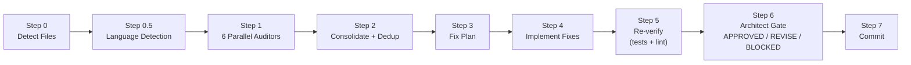

# CCA-Audit

**6-layer parallel code audit pipeline powered by LLMs.**

CCA-Audit runs 6 specialized auditors in parallel on your codebase, deduplicates findings, auto-fixes critical issues, re-verifies, and gates the result through an architect review -- all in one command.

Works with **any language** (Python, TypeScript, Go, Rust, Java, Ruby) via auto-detection.

## Pipeline



### The 6 Auditors

Each auditor has a **non-overlapping scope** -- no duplicate findings:

| Auditor | Scope | Does NOT Check |
|---------|-------|----------------|
| **Code Quality** | Type safety, DRY, complexity, naming, dead code | Security, runtime bugs, performance |
| **Bug Scanner** | Null refs, error handling, race conditions, resource leaks | Security vulns, code style |
| **Security** (single authority) | OWASP Top 10, injection, auth, secrets, CVEs | Runtime bugs, code quality |
| **Performance** | Slow queries, hot paths, memory, connection pools | Security, code style |
| **Documentation** | Missing docs, stale comments, type annotations | TODOs, debug statements |
| **Environment** | Config completeness, format validation, naming | Secrets (owned by Security) |

Plus 2 support agents: **Dependency Auditor** (maintenance health, licenses, unused deps) and **Fix Planner** (dedup + prioritization).

## Three Variants

Choose the variant that fits your workflow:

### 1. Claude Code (Recommended)

Drop-in agents for [Claude Code](https://docs.anthropic.com/en/docs/claude-code). One command installs, one slash command runs.

```bash
# Install
curl -fsSL https://raw.githubusercontent.com/GiulioDER/cca-audit/main/claude-code/install.sh | bash

# Run
/audit-fix              # audit + fix all uncommitted changes
/audit-fix no-fix       # audit only, no fixes
/audit-fix p1-only      # fix only critical findings
/audit-fix commit 3     # audit last 3 commits
```

[Claude Code README](claude-code/README.md)

### 2. Codex CLI

Shell orchestrator for [OpenAI Codex CLI](https://github.com/openai/codex). Runs auditors in parallel via background jobs.

```bash
# Install
cd your-project && bash /path/to/cca-audit/codex/install.sh

# Run
bash cca-audit.sh                    # full pipeline
bash cca-audit.sh --no-fix           # audit only
bash cca-audit.sh --auditors security,bug   # specific auditors
```

[Codex README](codex/README.md)

### 3. OpenRouter API (Python CLI)

Standalone Python CLI. Works with any model via [OpenRouter](https://openrouter.ai/) (Claude, GPT-4, Gemini, Llama, etc.).

```bash
# Install
pip install cca-audit

# Run
cca-audit                          # full pipeline
cca-audit --no-fix                 # audit only
cca-audit --model anthropic/claude-sonnet-4   # choose model
cca-audit --format json            # JSON output
```

[OpenRouter README](openrouter/README.md)

## Priority Framework

All variants use the same 3-tier priority system:

| Priority | Criteria | Action |
|----------|----------|--------|
| **P1 Critical** | Security vulns, data corruption, auth bypass, injection | Fix before deploy |
| **P2 High** | DRY divergence risk, stale misleading comments, config inconsistencies | Fix now |
| **P3 Nice-to-have** | Cosmetic, style, naming, unused params | Deferred |

## Documentation

- [Pipeline Diagram](docs/pipeline-diagram.md) -- detailed walkthrough of each step
- [Auditor Scopes](docs/auditor-scopes.md) -- full non-overlapping scope matrix
- [Configuration](docs/configuration.md) -- all config options across variants
- [Extending](docs/extending.md) -- how to add custom auditors

## License

[MIT](LICENSE)
