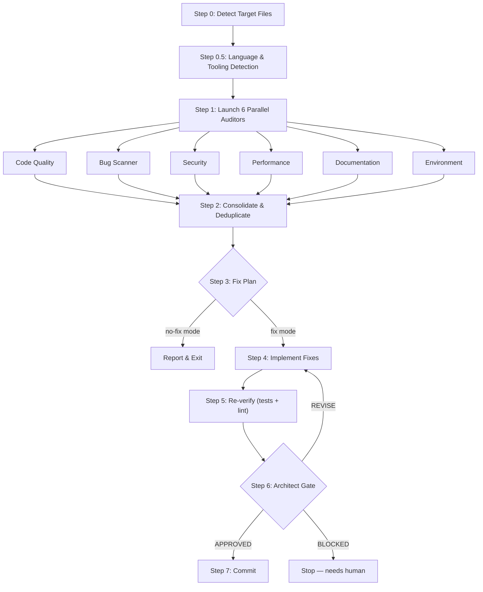

# Pipeline Diagram

## Overview

CCA-Audit runs a deterministic 7-step pipeline (plus a Step 0.5 for language detection). The key insight is **parallel auditors with non-overlapping scopes** — each auditor is the sole authority for its domain, eliminating duplicate findings.

## Full Pipeline

## Step-by-Step

### Step 0: Detect Target Files

Determines which files to audit based on arguments:
- **Default**: all uncommitted changes (staged + unstaged vs HEAD)
- **`commit N`**: diff of last N commits
- **`files path1 path2`**: specific files only

If no changes found, the pipeline stops immediately.

### Step 0.5: Language & Tooling Detection

Auto-detects from file extensions and project files:

| Signal | Detection |
|--------|-----------|
| `.py` files | Python — looks for pytest, ruff |
| `.ts`/`.tsx` files | TypeScript — looks for jest/vitest, eslint |
| `.go` files | Go — uses `go test`, `golangci-lint` |
| `.rs` files | Rust — uses `cargo test`, `clippy` |
| `package.json` | Detects React, Next.js, Express |
| `manage.py` | Detects Django |

This information is passed to all auditors so they apply language-appropriate checks.

### Step 1: Parallel Auditors

All 6 auditors launch **simultaneously** (not sequentially). Each receives:
- The file list
- The diff command
- Detected languages
- Project context (if configured)

Each auditor produces findings with unique prefixes (CODE-001, BUG-001, SEC-001, etc.).

### Step 2: Consolidate & Deduplicate

After all auditors return, findings are merged:

1. **Same file:line across auditors** — merge into one finding, keep highest severity
2. **Same issue type on same file** — merge, cite all source auditors
3. **Verify before accepting** — ENV findings about missing config are checked with grep (common false positive)

### Step 3: Fix Plan

Findings are prioritized:
- **P1 Critical**: Always fix (security vulns, data corruption, auth bypass)
- **P2 High**: Fix unless `p1-only` mode (DRY divergence, config issues)
- **P3 Nice-to-have**: Deferred (cosmetic, naming)

In `no-fix` mode, the pipeline reports findings and stops here.

### Step 4: Implement Fixes

Each fix is applied with minimal diffs:
- Fix ONLY what the audit found
- No unrelated refactoring
- No test structure changes (unless a test is wrong)
- Uncertain fixes flagged as BLOCKED

### Step 5: Re-verify

Runs the detected test and lint commands:
- Tests must pass (baseline must hold)
- Linter must be clean on changed files
- If tests fail: diagnose, fix, re-run

### Step 6: Architect Gate

A final reviewer assesses the combined diff:

| Assessment | Criteria |
|------------|----------|
| Completeness | All P1/P2 findings resolved |
| Quality | Fixes follow project conventions |
| Correctness | No regressions introduced |
| Security | No new vulnerabilities |

Verdicts:
- **APPROVED** — proceed to commit
- **REVISE** — specific feedback, re-fix, re-verify (max 3 iterations)
- **BLOCKED** — needs human decision, pipeline stops

### Step 7: Commit

Creates a structured commit message listing all fixes by priority, with audit metadata.
