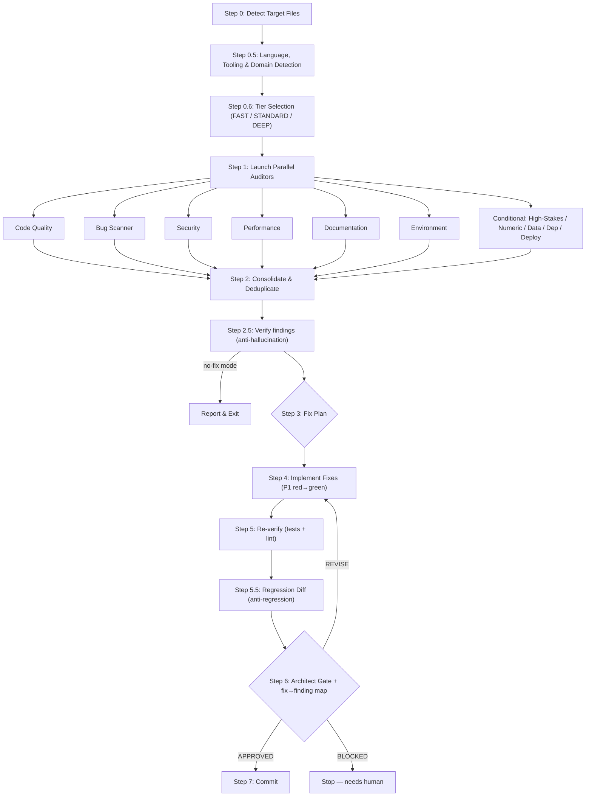

# Pipeline Diagram

## Overview

CCA-Audit runs a deterministic, **tiered** pipeline. A single `/audit-fix` command auto-selects a
tier (FAST / STANDARD / DEEP) from the diff's size and risk, then runs the matching stages. The key
insight is **parallel auditors with non-overlapping scopes** — each auditor is the sole authority for
its domain, eliminating duplicate findings — wrapped in verification gates that keep false positives
and regressions out.

## Full Pipeline (STANDARD / DEEP)

The **FAST** tier runs only the 3 core auditors (security, bug, code) and skips Steps 2.5 and 5.5.

## Step-by-Step

### Step 0: Detect Target Files

Determines which files to audit based on arguments:
- **Default**: all uncommitted changes (staged + unstaged vs HEAD) plus untracked files.
- **`commit N`**: diff of last N commits.
- **`files path1 path2`**: specific files only.
- **`hunt path1 path2`**: **hunt mode** — audit the named paths IN FULL (no diff) for pre-existing
  bugs, for a codebase you did not write. Sets `MODE = HUNT`; every other mode is `MODE = DIFF`.

If no changes found, the pipeline stops immediately.

### Step 0.4: Target Viability Pre-flight (hunt mode only)

Before any auditor runs against a repo you don't own, five gates must pass, else the pipeline STOPS:

| Gate | Rejects when |
|------|--------------|
| **Alive** | archived / deprecated / no commits in ~90 days / archive banner in the README |
| **Accepts contributions** | no `CONTRIBUTING.md` and no external merged PR in 6 months |
| **Test harness** | no runnable test suite (nowhere to put the red→green repro) |
| **Language** | transpiled / generated output rather than hand-written source |
| **Money / irreversible surface** | *(not a reject — decides whether the STAKES/NUM auditors dispatch)* |

This is the step that stops you auditing a corpse: a repo can have real code, real tests, and the
right bug class, and still carry a "no longer maintained" banner that makes any fix unmergeable.

### Step 0.5: Language, Tooling & Domain Detection

Auto-detects from file extensions and project files:

| Signal | Detection |
|--------|-----------|
| `.py` files | Python — looks for pytest, ruff |
| `.ts`/`.tsx` files | TypeScript — looks for jest/vitest, eslint |
| `.go` files | Go — uses `go test`, `golangci-lint` |
| `.rs` files | Rust — uses `cargo test`, `clippy` |

It also maps the diff to **domains** (high-stakes, numeric, data, dependency, deployability) to decide
which conditional auditors to dispatch.

**Detecting a language is not the same as being able to settle claims about it.** The table above
drives the auditors, which read code as text and work on anything. The *deterministic* layer covers
only Python and Rust, and it says so per file: `python -m cca_checks capabilities --file <F>` returns
the claim types settleable there, plus any whose tool is missing locally. Step 0.5 reports that as a
`COVERAGE:` line, so a run in which everything rode LLM adjudication is visible rather than inferred.

### Step 0.6: Tier Selection

Picks the tier from the diff:
- **DEEP** if the diff touches a high-stakes or numeric path (never auto-downgraded), or `deep` is forced.
- **FAST** if the diff is trivial (small, low-stakes, non-deploy), or `fast` is forced.
- **STANDARD** otherwise.

### Step 1: Parallel Auditors

The applicable auditors launch **simultaneously** (not sequentially). Each receives the file list, the
diff command, detected languages, the project context, and the canonical **findings schema**. Each
returns its findings as a structured JSON array (the authoritative output the orchestrator consumes).

### Step 2: Consolidate & Deduplicate

Findings are merged deterministically on `(file, line, category)`:
1. **Same `(file, line, category)`** — merge into one finding, keep highest severity.
2. **Same category on the same file within ±3 lines** — merge, cite all source auditors.
3. **Missing config/table/grant findings** — flagged for Step 2.5 verification (common false positive).

### Step 2.5: Findings Verification (anti-hallucination) — STANDARD / DEEP

Before any fix, P1/P2 findings are re-checked against the real code by an `fp-check` agent: does the
issue exist, is it in changed code, is the impact real, does it contradict a settled decision, or is it
already reported/fixed upstream? Verdict per finding: CONFIRMED / FALSE_POSITIVE / DUPLICATE (hunt
mode — cite the upstream URL) / UNCERTAIN. False positives and duplicates are dropped; uncertain ones
are escalated to the user (never fixed blind). **High-stakes P1 findings** get an adversarial **2-of-3**
check (three independent skeptics, default-to-refute) on the DEEP tier — **except** findings whose
verdict already rests on a tool artifact (`pyright`, `clippy`, `ast`, `semgrep`, `pytest`, `hypothesis`), notably a
`NUM-*` P1 carrying a `hypothesis` artifact. The artifact settles it; an LLM majority does not get to
outvote a falsifying example. Conversely, on DEEP a `NUM-*` P1 may **not** enter the fix plan without
that artifact.

### Step 3: Fix Plan

From CONFIRMED findings only:
- **P1 Critical**: always fix.
- **P2 High**: fix unless `p1-only` mode.
- **P3 Nice-to-have**: deferred.

In `no-fix` mode, the pipeline reports findings + verdicts and stops here.

### Step 4: Implement Fixes

Each fix is applied with minimal diffs (fix ONLY what was confirmed; no unrelated refactoring; no test
structure changes unless a test is wrong; uncertain fixes flagged BLOCKED). On STANDARD/DEEP, each
CONFIRMED P1 follows **red→green**: write a failing test that reproduces the bug, then fix, then confirm green.

### Step 5: Re-verify

Runs the detected test and lint commands — baseline plus any new P1 tests must pass; linter clean on
changed files. If tests fail: diagnose, fix, re-run.

### Step 5.5: Regression Diff (anti-regression) — STANDARD / DEEP

A `differential-review` agent reviews ONLY the fix diff, mapping each hunk to the finding it serves and
flagging any behaviour change outside scope. Verdict per hunk: SAFE / SCOPE_CREEP / REGRESSION_RISK.

### Step 6: Architect Gate

A read-only final reviewer assesses the combined diff (it has no write tools — it returns REVISE with
instructions rather than fixing anything itself):

| Assessment | Criteria |
|------------|----------|
| Completeness | All P1/P2 findings resolved |
| Quality | Fixes follow project conventions |
| Correctness | No regressions introduced |
| Security | No new vulnerabilities |

On STANDARD/DEEP it also emits a **fix→finding mapping** table — an orphan P1 (or a P1 missing its
red→green test) or a phantom fix forces a REVISE. Verdicts: **APPROVED** (commit) / **REVISE** (re-fix,
re-verify, max 3 iterations) / **BLOCKED** (needs human).

### Step 7: Commit

Creates a structured commit message listing all fixes by priority, with audit metadata (tier, auditor
counts, confirmed/dropped findings).
